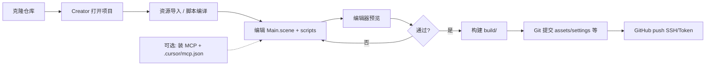

# FlappyBird 项目研发流程与注意事项

## 一、项目概览


| 项     | 说明                               |
| ----- | -------------------------------- |
| 引擎    | Cocos Creator **3.8.8**（2D）      |
| 设计分辨率 | **360×640**（`fitWidth`）          |
| 启动场景  | `assets/scenes/Main.scene`       |
| 玩法    | 经典 Flappy Bird：点击飞行、穿管道、计分、本地最高分 |


---

## 二、目录与职责

```
FlappyBird/
├── assets/                 # 必须提交：场景、脚本、贴图
│   ├── scenes/Main.scene   # 主场景（勿用默认 scene-2d）
│   ├── scripts/            # 游戏逻辑
│   └── textures/           # sky / ground / bird / pipe
├── settings/               # 必须提交：分辨率、启动场景等
├── package.json            # 项目 UUID、Creator 版本
├── tsconfig.json           # TS 编译配置
├── docs/                   # 文档与 MCP 模板
├── library/ temp/ build/   # 不提交：缓存与构建产物
├── extensions/             # 不提交：Cocos MCP 扩展（本地安装）
└── .cursor/                # 不提交：Cursor MCP 连接配置
```

### 脚本分工


| 脚本                  | 职责                                |
| ------------------- | --------------------------------- |
| `GameConfig.ts`     | 常量、状态枚举、接口（避免循环引用）                |
| `GameManager.ts`    | 状态机、输入、分数、UI 刷新、引用解析              |
| `BirdController.ts` | 小鸟物理、碰撞、死亡事件 `bird-died`          |
| `PipeManager.ts`    | 管道生成/移动/碰撞/计分（引用由 GameManager 注入） |
| `Pipe.ts`           | 单组管道绘制与 AABB                      |
| `GameUI.ts`         | 分数与提示文案                           |


### 场景层级（Main.scene）

```
Main → Canvas → Camera, GameRoot
  GameRoot → Background, Ground, GameLayer, UI
  GameLayer → Bird (+ BirdController), Pipes (+ PipeManager)
  UI → Score / Hint / GameOver / Best (+ GameUI)
  GameRoot → GameManager
```

Canvas **只挂** `UITransform`、`Canvas`、`Widget`，不要挂自定义脚本。

---

## 三、推荐研发流程

### 1. 环境准备

1. 安装 **Cocos Creator 3.8.8**，用编辑器打开本仓库根目录。
2. 首次打开等待 **资源导入** 与 **脚本编译** 完成。
3. （可选）本地安装 `extensions/cocos-mcp-server`，按 [MCP_SETUP.md](./MCP_SETUP.md) 配置 Cursor，用于 AI 改场景。

### 2. 日常开发

1. 打开 `**Main.scene`**（确认 `settings` 里 `launchScene` 指向它）。
2. 在 **资源管理器** 改脚本 / 贴图；在 **场景编辑器** 调节点与组件引用。
3. 点击 **播放** 预览；有问题看 **控制台** 与 **场景** 里是否有 Missing Script。
4. 改脚本后若异常：**开发者 → 重新编译脚本**，或 **资源 → 刷新**。

### 3. 构建发布

1. **项目 → 构建发布**，选 Web / 原生等平台。
2. 产物在 `build/`（已在 `.gitignore`，不提交）。
3. 构建前确认控制台无 error；仅有 MCP 相关 log 可忽略（未装扩展时）。

### 4. 版本管理（Git）

**应提交**

- `assets/`、`assets.meta`、`package.json`、`settings/`、`tsconfig.json`、`.gitignore`、`docs/`

**不提交**

- `library/`、`temp/`、`local/`、`build/`、`profiles/`、`node_modules/`
- `.creator/`、`.cursor/`、`extensions/`

**推送 GitHub**

- HTTPS 需 **Personal Access Token** 或改用 **SSH**（不支持账号密码 push）。
- clone 后需本地再装 MCP 扩展（`extensions/` 未进库）。

---

## 四、玩法与验证清单


| 阶段  | 操作                    |
| --- | --------------------- |
| 准备  | 点击 / 空格 / Enter → 开始  |
| 游戏中 | 点击 / 空格 / Enter → 向上飞 |
| 结束  | 再点一次 → 重开             |


### 发布前自检

- 启动场景为 `Main.scene`
- GameRoot 上有 `GameManager`，Bird 有 `BirdController`，Pipes 有 `PipeManager`
- 无 Missing Script、无脚本循环引用报错
- 能穿管道加分、撞管/地面/天花板会结束

---

## 五、重要注意事项

### 1. 资源与 Meta

- **不要手写伪造** 的 `*.ts.meta` UUID（曾导致 Canvas 上 Missing Script）。
- 删除 meta 后让 Creator **自动生成**；场景里失效引用要在编辑器里清掉或重挂组件。
- 保存场景时若提示保存旧脏数据，对 **已手工修过的 Main.scene** 可选 **不保存**，避免无效脚本写回。

### 2. 脚本架构

- **禁止** `BirdController ↔ GameManager ↔ PipeManager` 三角 import。
- `BirdController` 用事件 `bird-died` 通知死亡；`PipeManager` 的 `bird` / `gameManager` **不用 `@property`**，由 `GameManager.resolveReferences()` 注入。
- `GameManager` 对子组件用 `@property(BirdController)` 等 **类引用**；`PipeManager` 不要用 `{ type: 'GameManager' }` 字符串（未加载时会 Unknown type）。

### 3. 场景与编辑器

- 不要用默认空场景 **scene-2d** 当主场景。
- 管道由代码动态创建，**无需** Pipe 预制体。
- `GameManager.bird` 在场景里可为空，运行时会 `getComponentInChildren` 查找。

### 4. MCP / Cursor（可选）

- **每个 Cocos 项目** 都要本地装扩展；**不能**多工程同时共用一个 `localhost:3000`。
- 单项目：端口 3000；多项目并行：每工程不同端口（3000、3001…），Cursor 工作区 `mcp.json` 与之一致。
- 详见 [MCP_SETUP.md](./MCP_SETUP.md) 与 [templates/](./templates/)。

### 5. 协作与克隆

- 新成员 clone 后：打开 Creator → 等编译 → 打开 `Main.scene` → 播放测试。
- 需要 AI 编辑时再装 MCP；游戏本身不依赖 MCP。
- `settings/mcp-server.json` 若团队统一端口可提交；个人改端口可本地忽略。

---

## 六、常见问题速查


| 现象                                  | 可能原因                       | 处理                             |
| ----------------------------------- | -------------------------- | ------------------------------ |
| Script missing / 无效 UUID            | 假 meta 或场景脏引用              | 清 Canvas 无效脚本、删假 meta、刷新资源     |
| circular reference / undefined type | 脚本互相 import                | 按当前架构：事件 + 注入，勿恢复三角引用          |
| Unknown type 'GameManager'          | PipeManager 用字符串 @property | 改为无 @property，由 GameManager 赋值 |
| git push 认证失败                       | HTTPS 用密码                  | 改用 PAT 或 SSH                   |
| 黑屏 / 无游戏                            | 未用 Main.scene              | 检查 launchScene 与层级             |
| MCP 连不上                             | Creator 未启动 MCP / 端口不一致    | 见 MCP_SETUP 与健康检查 URL          |


---

## 七、流程总览




---

## 相关文档

- [MCP_SETUP.md](./MCP_SETUP.md) — Cocos MCP Server 单项目 / 多项目配置模板
- [templates/](./templates/) — `mcp.json` 与 `mcp-server.json` 可复制模板

